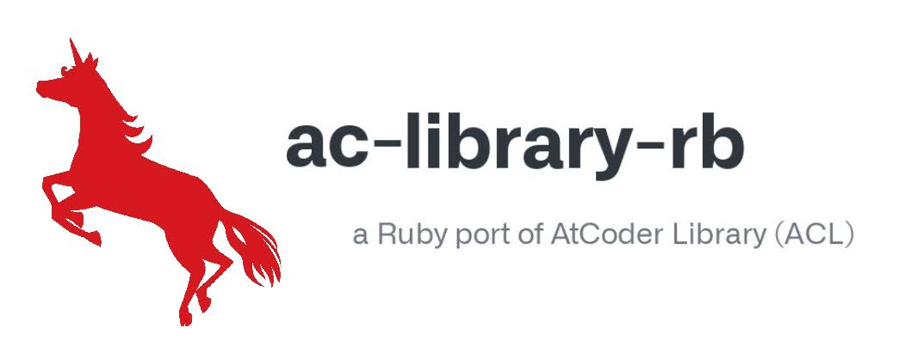

### Other language Japanese version(ver. 日本語)

[README 日本語バージョン(ver. Japanese)](README.ja.md)
- [ライブラリ目次: index.md](https://github.com/universato/ac-library-rb/blob/main/document_ja/index.md)

<hr>

# ac-library-rb  

[](https://badge.fury.io/rb/ac-library-rb)
[](https://codecov.io/gh/universato/ac-library-rb)



ac-library-rb is a ruby port of AtCoder Library (ACL).

See below for ACL.

- [AtCoder Library (ACL) - AtCoder](https://atcoder.jp/posts/517)
- [AtCoder Library - Codeforces](https://codeforces.com/blog/entry/82400)
- [atcoder/ac-library - GitHub](https://github.com/atcoder/ac-library)

# Ruby version

Currently, the Ruby version in AtCoder is 2.7.1.

Therefore, 2.7 and the latest 3.1 are tested.

# Document

Please read [index.md](https://github.com/universato/ac-library-rb/blob/main/document_en/index.md).

## How to use ac-library-rb as a Gem

We will show you how to use ac-library-rb as a gem.
## How to install

This is not limited to ac-library-rb, but I will show you how to install the two common types of gem.

- By `gem` command, `gem install ac-library-rb`.
- By using the gem bundler's commands.

#### By gem command, `gem install ac-library-rb`

Execute `gem install ac-library-rb` by using the gem command included in Ruby itself.

#### How to use the gem bundler

If you have not installed bundler, type `gem install bundler` to install it.

Next, place Gemfile under the directory where you want to use ac-library-rb.  

In this Gemfile, write: 

```ruby
gem "ac-library-rb".
```

Then, install ac-library-rb by using the command `budnle install`.

At this point, we need to run the Ruby file through bundler, so we use the command `bundle exec`.

`$ bundle exec ruby sample.rb`.

### How to write in Ruby files (after installation)

#### Bulk loading

To enable the ac-library-rb library to be used in bulk on Ruby files, write as follows.

```ruby
require "ac-library-rb/all"

dsu = AcLibraryRb::DSU.new

include AcLibraryRb
dsu = DSU.new
```

#### Individual loading

If you want to install only a specific library, specify the library name after `ac-library-rb/` as shown below.

```ruby
require "ac-library-rb/dsu"
dsu = AcLibraryRb::DSU.new

require "ac-library-rb/priority_queue"
pq = AcLibraryRb::PriorityQueue.new
```

Note that the gem names are separated by hyphens, but the library names in ac-library-rb are separated by underscores. 
In general, underscores are recommended for Ruby library names.
However, the repository names in the original ACL are separated by a hyphen, ac-library, so ac-library-rb is also separated by a hyphen.

## Development: How to Contirubute

After checking out the repo, run `bin/setup` to install dependencies. Then, run `rake test` to run the tests. You can also run `bin/console` for an interactive prompt that will allow you to experiment.

```bash
$ rake test
$ rake
$ ruby test/fenwick_tree_test.rb
```

# Other

## Other languages's ac-library

- [Unofficial Portings of AtCoder Library](https://docs.google.com/spreadsheets/d/19jMAqUbv98grVkLV_Lt54x5B8ILoTcvBzG8EbSvf5gY/edit#gid=0) (by [not522-san](https://github.com/not522))


## Other language Japanese version

[README 日本語バージョン(ver. Japanese)](README.ja.md)
- [ライブラリ目次: index.md](https://github.com/universato/ac-library-rb/blob/main/document_ja/index.md)
